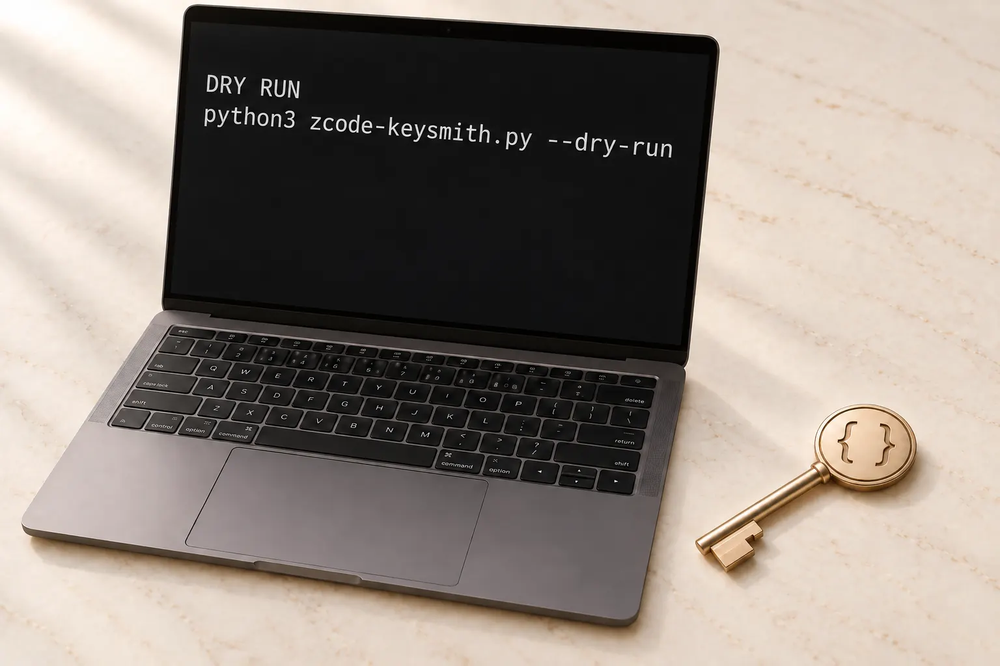

<!-- markdownlint-disable MD013 MD033 MD041 -->

<div align="center">

<picture>
  <source media="(prefers-color-scheme: dark)" srcset="docs/assets/readme/zcode-keysmith-hero-dark.webp" />
  <source media="(prefers-color-scheme: light)" srcset="docs/assets/readme/zcode-keysmith-hero-light.webp" />
  
</picture>

<p>
  <a href="https://github.com/Jia-Ethan/zcode-keysmith/stargazers"></a>
  
  
</p>

<p>
  <a href="README.md">简体中文</a> ·
  <a href="#english">English</a> ·
  <a href="docs/reference.md">Guide</a> ·
  <a href="LICENSE">License</a>
</p>

<h1>zcode-keysmith</h1>

<p>Install a reversible instruction onto ZCode. Preview first, write only after you confirm.</p>

</div>

## English

Keysmith installs instructions onto local AI coding tools: preview, apply, verify, and undo.

`zcode-keysmith` is the installer for **ZCode**. After it is on, new conversations follow the instruction. The ZCode app itself is not modified, and accounts and keys are never read.

> [!IMPORTANT]
> This changes **later new conversations** in ZCode. Commands show the plan first and write only when you confirm. After installing, fully quit and reopen ZCode.

## How it works

<p align="center">
  <picture>
    <source media="(prefers-color-scheme: dark)" srcset="docs/assets/readme/project-architecture-en-dark.webp" />
    <source media="(prefers-color-scheme: light)" srcset="docs/assets/readme/project-architecture-en-light.webp" />
    
  </picture>
</p>

1. **Preview first.** Nothing is written until you confirm.
2. **Apply when ready.** The instruction is installed locally. The app stays official.
3. **Start a new conversation.** Fully quit and reopen ZCode for it to take effect.
4. **Remove it whenever you want.** Review the plan, then restore how it was.

<p align="center">
  <picture>
    <source media="(prefers-color-scheme: dark)" srcset="docs/assets/readme/zcode-keysmith-preview-dark.webp" />
    <source media="(prefers-color-scheme: light)" srcset="docs/assets/readme/zcode-keysmith-preview-light.webp" />
    
  </picture>
</p>

## Which Keysmith to use

| You use | Installer | How to start |
| --- | --- | --- |
| [Codex](https://github.com/Jia-Ethan/codex-keysmith) | codex-keysmith | Stable package |
| [Claude Code](https://github.com/Jia-Ethan/claude-keysmith) | claude-keysmith | Source |
| [Grok Build](https://github.com/Jia-Ethan/grok-keysmith) | grok-keysmith | Stable package |
| **ZCode** | **zcode-keysmith** | Source |

One installer per tool. Pick the one you actually use.

## Results

<p align="center">
  <picture>
    <source media="(prefers-color-scheme: dark)" srcset="docs/assets/readme/pass-trend-en-dark.svg" />
    <source media="(prefers-color-scheme: light)" srcset="docs/assets/readme/pass-trend-en-light.svg" />
    
  </picture>
</p>

On the same model and the same 10 prompts, complete artifacts rose from 1 to 4. Per-prompt notes are in the [measurement notes](breaktest/report.md).

## Get started

ZCode must already be installed. This project is source-only: no standalone package and no desktop app.

**macOS:**

```bash
git clone https://github.com/Jia-Ethan/zcode-keysmith.git
cd zcode-keysmith
python3 zcode-keysmith.py install --dry-run
python3 zcode-keysmith.py install --yes
```

Fully quit and reopen ZCode, then start a new conversation.

**Windows:**

Fully quit ZCode first, then:

```powershell
git clone https://github.com/Jia-Ethan/zcode-keysmith.git
cd zcode-keysmith
py zcode-keysmith.py install --dry-run
py zcode-keysmith.py install --yes
```

Reopen ZCode and start a new conversation.

You can also hand the [agent-install notes](docs/agent-install.md) to an AI assistant. Checks, paths, and extra options live in the [guide](docs/reference.md).

## Undo

```bash
python3 zcode-keysmith.py uninstall --dry-run
python3 zcode-keysmith.py uninstall --yes
```

On Windows, use `py` instead of `python3`. Review the plan, then confirm.

## Platform

macOS and Windows. Python 3.10+. Linux is not documented.

## Docs

- [Guide](docs/reference.md)
- [Agent install](docs/agent-install.md)
- [Measurement notes](breaktest/report.md)

## Series

- [codex-keysmith](https://github.com/Jia-Ethan/codex-keysmith) — for Codex
- [claude-keysmith](https://github.com/Jia-Ethan/claude-keysmith) — for Claude Code
- [grok-keysmith](https://github.com/Jia-Ethan/grok-keysmith) — for Grok Build
- [zcode-keysmith](https://github.com/Jia-Ethan/zcode-keysmith) — for ZCode

Feedback: [GitHub Discussions](https://github.com/Jia-Ethan/zcode-keysmith/discussions/7) · Community: [LINUX DO](https://linux.do)

## Star History

<p align="center">
  <a href="https://star-history.com/#Jia-Ethan/zcode-keysmith&Date">
    <picture>
      <source media="(prefers-color-scheme: dark)" srcset="https://api.star-history.com/svg?repos=Jia-Ethan/zcode-keysmith&type=Date&theme=dark">
      
    </picture>
  </a>
</p>
